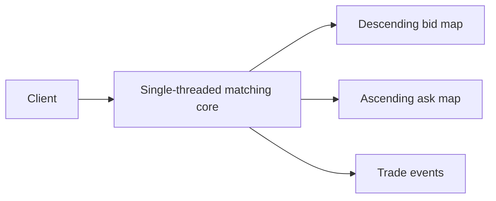

# C++ Order Book

A small C++20 limit order book and matching engine core. It demonstrates price-time priority, partial fills, cancellation, and deterministic single-threaded matching. It is an educational portfolio project, not an exchange system.

## Features

- Limit and market orders, partial fills, and cancellation by order ID.
- Best bid/ask, spread, aggregated depth snapshots, and trade events.
- Integer price ticks, FIFO within each price, and no third-party runtime dependencies.

## How matching works

Bids match the lowest asks at or below the buy limit. Asks match the highest bids at or above the sell limit. A trade uses the resting order's price. Market orders consume the available opposite side; any unfilled remainder is canceled.

For example, with `SELL 10 @ 100`, an incoming `BUY 4 @ 105` produces `TRADE 4 @ 100`; `SELL 6 @ 100` remains.

## Architecture and data structures



The core is intentionally single-threaded and contains no locks. A future adapter can serialize commands through one worker thread and a synchronized queue; this first stage keeps the matching rules easy to test and deterministic.

Each side uses `std::map` to keep price levels ordered. Each price level stores orders in a `std::list`, preserving FIFO order and allowing an indexed order to be erased without scanning its level. An `unordered_map` maps live order IDs to their side, price, and list iterator. A separate ID set prevents ID reuse for the lifetime of a book.

Integer price ticks avoid floating-point rounding in comparisons and matching. The application decides what one tick means (for example, one cent); the core does not apply currency formatting.

## Complexity

Let `P` be the number of price levels and `N` the number of resting orders consumed by a match.

| Operation | Complexity |
| --- | --- |
| Best bid / ask | O(1) |
| Add a resting order | O(log P) map work, plus expected O(1) index work |
| Cancel by ID | Expected O(1) lookup and list erase, plus O(log P) if its level becomes empty |
| Match | O(N), plus O(log P) for each emptied level removed |
| Snapshot | O(K), where K is the number of returned price levels |

## Build

```bash
cmake -S . -B build
cmake --build build
```

## Tests

```bash
ctest --test-dir build --output-on-failure
```

The tests use a small in-repository runner, so a clean build does not need GoogleTest or network access.

## Example

```bash
./build/order_book_app
```

Expected output:

```text
TRADE 4 @ 100
ASK 6 @ 100
```

The C++ API is in `include/orderbook/order_book.hpp`. Invalid prices, zero quantities, invalid sides, and reused IDs throw `std::invalid_argument`. IDs remain reserved after an order is canceled or filled, so the uniqueness set grows with the number of submitted orders during the book's lifetime.

## Future work

- A command queue and matching-engine worker with graceful shutdown.
- A public async command API, stronger property-based tests, and an optional benchmark.
- Storage and allocator experiments after profiling a stated workload.
